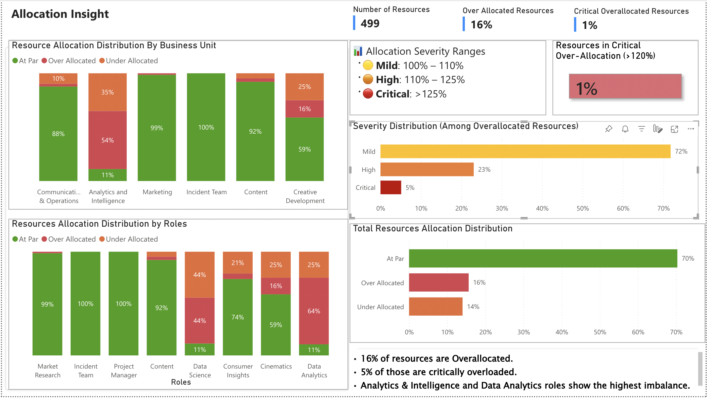

# Resource Allocation Dashboard (Power BI)
## Problem Statement
Organizations often struggle to identify resource overallocations across business units and roles.  
This dashboard helps identify mild, high, and critical overallocation levels so managers can rebalance workload.

## Key Insights

• 16% of resources are overallocated  
• 1% of resources are critically overallocated (>120%)  
• Some business units show higher workload imbalance  
• Majority of resources are optimally allocated

## Dashboard Features

• Allocation distribution across resources  
• Severity classification (Mild, High, Critical)  
• Business Unit and Role distribution  
• Overallocated vs optimally allocated resources  
• Critical allocation KPI indicator

## Dashboard Preview

## File
Download the Power BI file: dashboard.pbix
